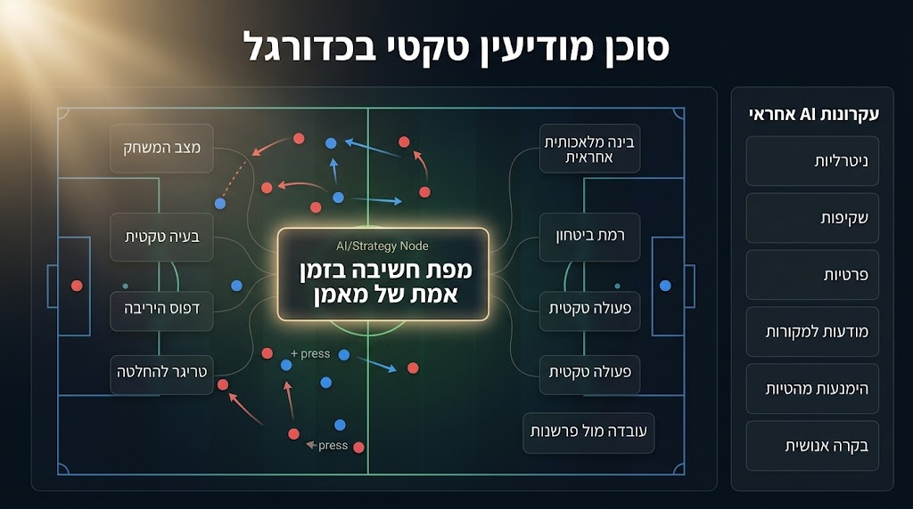

# Football Tactical Intelligence Agent

A custom AI agent prototype for football tactical intelligence, focused on real-time coaching decisions, tactical discipline, and Responsible AI.
The main case study is **Hajime Moriyasu**, head coach of Japan’s national football team.

## Project Overview

This project explores how an AI assistant can help users understand football not only through scores and statistics, but through the decision-making logic of a coach during a live match.

Instead of asking only:

> Who won?

The agent asks:

> What changed in the game, what tactical problem appeared, and what decision could move the team closer to control and victory?

The prototype was built as a custom **Gemini Gem** with a Hebrew-first interaction style, a tactical coaching persona, source-aware reasoning, and Responsible AI constraints.

## Main Idea

The agent is designed to analyze football through a framework called:

## Coach Real-Time Thinking Map

The framework breaks tactical events into:

1. Match minute / game state
2. Tactical problem
3. Opponent pattern
4. Likely coach question
5. Decision trigger
6. Coaching action
7. Expected tactical effect
8. Actual result
9. Fact vs interpretation
10. Confidence level

## Case Study: Hajime Moriyasu and Japan

Hajime Moriyasu is used as a central case study because his Japan teams are often discussed through themes such as tactical discipline, patience, substitutions, formation changes, and second-half adjustments.

The agent does not try to “read the coach’s mind.”
Instead, it carefully reconstructs possible tactical logic based on match events, sources, and cautious interpretation.

## Responsible AI Principles

This project also focuses on responsible AI behavior:

* Neutral prompting
* Clear role definition
* Separation between facts and interpretation
* Fact-checking and source awareness
* Avoiding unsupported claims
* Avoiding political, ethnic, religious, or cultural stereotyping
* Copyright awareness
* Transparency and explainability
* Privacy and data responsibility
* Limiting overconfident answers

## Prototype Features

The agent can:

* Explain tactical decisions in simple Hebrew
* Analyze substitutions and formation changes
* Distinguish facts from interpretation
* Use a calm, professional coaching tone
* Avoid unsupported speculation
* Ask clarifying questions when the user’s level is unclear
* Provide concise answers unless deeper analysis is requested

## Example Questions

Users can ask:

```text
איך Moriyasu קורא משחק בזמן אמת?
```

```text
מהי מפת חשיבה בזמן אמת של מאמן?
```

```text
מה אפשר ללמוד מהמשחק יפן-גרמניה 2022 על קבלת החלטות?
```

```text
מה ההבדל בין עובדה לפרשנות בניתוח טקטי?
```

## Current Status

Prototype stage.

The current version was built as a custom Gemini Gem.
Future versions may include:

* Interactive React dashboard
* Visual tactical board
* Structured match database
* More verified sources
* Public demo interface
* GitHub-based documentation and examples

## Visual Preview



```text
/assets/project-visual.png
```

## Disclaimer


This is an educational and analytical prototype.
It does not claim to know the private thoughts of any coach.
All interpretations should be treated as cautious tactical analysis based on available information.

